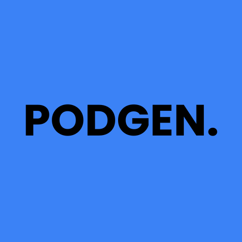

<!-- PROJECT LOGO -->
<br />
<div align="center">
  <a href="https://github.com/scriptmaze/podgen">
    
  </a>

<h3 align="center">PodGen</h3>

  <p align="center">
    A creative platform that generates podcasts from any PDF
    <br />
    <a href="https://youtu.be/678CK6uHKaE"><strong>View Demo »</strong></a>
    <br />
    <br />
    <a href="https://github.com/scriptmaze/podgen/issues/new?labels=bug&template=bug-report---.md">Report Bug</a>
    ·
    <a href="https://github.com/scriptmaze/podgen/issues/new?labels=enhancement&template=feature-request---.md">Request Feature</a>
  </p>
</div>

## About The Project

PodGen is a creative platform that generates podcasts from any PDF. This project consists of a backend built with Django and a frontend built with React.

### Built With

* [![Django][Django]][Django-url]
* [![React][React.js]][React-url]
* [![Google Cloud][Google-cloud]][Google-cloud-url]
* [![Tailwind CSS][TailwindCSS]][TailwindCSS-url]
* [![AWS][AWS]][AWS-url]

[Django]: https://img.shields.io/badge/Django-092E20?style=for-the-badge&logo=django&logoColor=white
[Django-url]: https://www.djangoproject.com/
[React.js]: https://img.shields.io/badge/React-20232A?style=for-the-badge&logo=react&logoColor=61DAFB
[React-url]: https://reactjs.org/
[Google-cloud]: https://img.shields.io/badge/Google%20Cloud-4285F4?style=for-the-badge&logo=google-cloud&logoColor=white
[Google-cloud-url]: https://cloud.google.com/
[TailwindCSS]: https://img.shields.io/badge/Tailwind_CSS-38B2AC?style=for-the-badge&logo=tailwind-css&logoColor=white
[TailwindCSS-url]: https://tailwindcss.com/
[AWS]: https://img.shields.io/badge/AWS-232F3E?style=for-the-badge&logo=amazon-aws&logoColor=white
[AWS-url]: https://aws.amazon.com/

### Table of Contents

- [About The Project](#about-the-project)
  - [Built With](#built-with)
  - [Table of Contents](#table-of-contents)
- [Project Structure](#project-structure)
- [Backend](#backend)
  - [Key Files](#key-files)
  - [Main Functions](#main-functions)
- [Frontend](#frontend)
  - [Key Files](#key-files-1)
  - [Available Scripts](#available-scripts)
- [How It Works](#how-it-works)
- [Future Features](#future-features)
- [How to Run](#how-to-run)
- [Usage](#usage)
- [Contributing](#contributing)
- [License](#license)


## Project Structure
```bash
podgen
├── backend
│ ├── init.py
│ ├── asgi.py
│ ├── logs
│ │ └── app.log
│ ├── pdf_2_script
│ │ ├── init.py
│ │ ├── extract_text.py
│ │ └── GoogleTTS
│ ├── settings.py
│ ├── urls.py
│ ├── views.py
│ └── wsgi.py
├── db.sqlite3
├── frontend
│ ├── .gitignore
│ ├── package.json
│ ├── public
│ ├── README.md
│ ├── src
│ │ ├── App.js
│ │ └── components
│ │ └── FileUpload.js
│ └── tailwind.config.js
├── manage.py
├── media
│ └── podcast_output_folder
│ └── GoogleTTS
├── README.md
├── requirements.txt
└── TEMPORARY_FILES_FOLDER
├── png_output_folder
├── text_output_folder
└── uploaded_files
```

## Backend

The backend is built with Django and handles the PDF to podcast conversion process.

### Key Files

- `backend/settings.py`: Django settings for the project.
- `backend/urls.py`: URL routing for the backend.
- `backend/views.py`: Views for handling requests.
- `backend/pdf_2_script/`: Contains scripts for converting PDFs to podcasts.
- `backend/logs/app.log`: Log file for debugging.

### Main Functions

- `main.py`: Main script to convert PDF to podcast.
- `extract_text.py`: Extracts text from PDF images.
- `GoogleTTS/tts.py`: Uses Google Text-to-Speech to create audio files.

## Frontend

The frontend is built with React and provides a user interface for uploading PDFs and generating podcasts.

### Key Files

- `frontend/src/App.js`: Main React component.
- `frontend/src/components/FileUpload.js`: Component for uploading PDF files.
- `frontend/tailwind.config.js`: Tailwind CSS configuration.

### Available Scripts

- `npm start`: Runs the app in development mode.
- `npm run build`: Builds the app for production.
- `npm test`: Launches the test runner.

## How It Works

PodGen uses several services to convert PDFs into podcasts:

1. **File Upload**: Users upload a PDF file through the frontend.
2. **Text Extraction**: The backend uses `extract_text.py` to extract text from the PDF.
3. **Text-to-Speech**: The extracted text is sent to the Google Text-to-Speech API to generate audio files.
4. **Podcast Generation**: The audio files are combined to create a podcast, which is then made available for download.

## Future Features

Here are some features we plan to include in future versions of PodGen:

- **Multi-language Support**: Allow users to generate podcasts in multiple languages.
- **Voice Customization**: Provide options for different voices and accents.
- **Chapter-based Navigation**: Enable users to navigate podcasts by chapters.
- **Integration with Podcast Platforms**: Allow users to directly upload their podcasts to popular platforms like Spotify and Apple Podcasts.

## How to Run

1. Clone the repository.
2. Rename the .env.example file to .env and edit it:
   ```sh
   ENVIRONMENT=local
   DEBUG=True
4. Install the root requirements:
   ```sh
   pip install -r requirements.txt
5. Set up the backend:
   ```sh
   python manage.py migrate
   python manage.py runserver
6. Set up the frontend:
   ```sh
   cd frontend
   npm install
   npm start

## Usage

1. Open the frontend in your browser.
2. Upload a PDF File.
3. Wait for the podcast to be generated.
4. Download and enjoy your podcast.

## Contributing

Contributions are welcome! Please open an issue or submit a pull request.

## Authors

- [Hossam Moustafa](https://github.com/scriptmaze)
- [Étienne Goulet](https://github.com/etiennegoulet)
- [Émile Jacques](https://github.com/ejm22)
